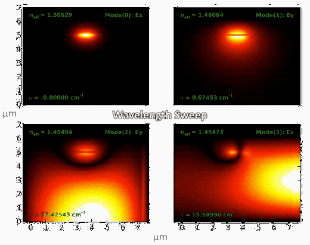
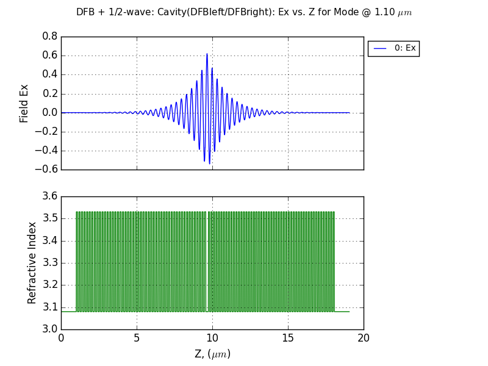
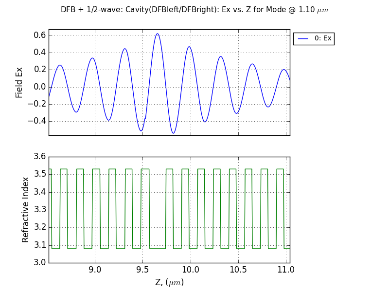

# pyFIMM
A Python Interface to [PhotonDesign's FimmWave/FimmProp software](http://www.photond.com/products/fimmwave.htm).
Interface based on [Peter Beinstman's CAMFR simulation software](http://camfr.sourceforge.net).
Originally created by Jared F. Bauters at the [University of California Santa Barbara](ucsb.edu) in 2011; 
Updated by Demis D. John, 2014-present.

## Description

pyFIMM provides a Python scripting interface to [Photon Design's FIMMWAVE/FIMMPROP electromagnetic/photonic simulation tools](http://www.photond.com/products/fimmwave.htm), to construct, simulate, sweep, plot and analyze photonic devices using FimmWave.  This enables one to do additional analysis and math on your simulations from python itself, and define complex Python functions or loops that use FimmWave to do the heavy-lifting of solving for modes and Scattering Matrices, but analyze and plot the data in Python. You can also interact with nodes you've constructed using the PhotonDesign GUIs. FimmWave can return solved field values & mode profiles or plot modes/fields directly in MatPlotLib.

The FimmWave/FimmProp GUI contains much functionality that is not implemented by *pyFIMM*, so pyFIMM includes the ability to import saved Projects, Devices and Waveguides and run analysis on them. This way you can design your device in the FimmProp GUI, and run sweeps, data analysis and plotting via pyFIMM.

Some examples of pyFIMM's utility include large multivariable sweeps and subsequent plotting (eg. waveguide width, thickness and wavelength) & devices that require analysis between sweep iterations (eg. the resonant cavity, in which eigenvalues are calculated at each wavelength to determine the resonant wavelength and resulting cavity mode profile).
Some analysis functions are included, based on examples provided by Photon Design.  Some useful features are the ability to solve/plot the fields in an optical Cavity & Mode/Field-plotting.

### Wavelength Sweep of a Waveguide object:

### Cavity Mode Solver, locating the cavity resonance at 1.100 microns

The interface is set up like [Peter Beinstman's CAMFR (CAvity Modelling FRamework)](http://camfr.sourceforge.net) system, in which 1-D Slices are concatenated to produce arbitrary 2-D index profiles, which can be further concatenated to produce full 3-D photonic integrated circuits. This is also similar to how you construct waveguides via Slices in the FimmWave GUI.

Photon Design's Python library, `pdPythonLib`, is included in the module.

## Brief Example
Example of rectangular waveguide construction syntax: We will create a rectangular waveguide of SiO2 cladding and SiN core, calculate the fundamental mode & plot it. 

The following assumes you imported the module via `import pyfimm`, with your script residing in the same directory as the *pyfimm* folder.  `pyfimm` could be replaced with whatever name you imported the pyFIMM module under - for example, if you imported it like so:

    >>> import pyfimm as pf
    
then replace `pyfimm` with `pf` in the following examples.

First, create some Materials with some refractive index:

    >>> SiO = pyfimm.Material( 1.45 )    # refractive index of SiO2
    >>> SiN = pyfimm.Material( 2.01 )    # refractive index of Si3N4

Then, create some 1-D slabs, by calling those Materials with a thickness value, and adding them together from top to bottom in a Slice:

    clad = pyfimm.Slice(  SiO(15.75)  )      # Thicknesses in microns
    core = pyfimm.Slice(  SiO(10.0) + SiN(2.5) + SiO(5.0)  )
    
This created an imaginary structure from bottom-to-top. For example `core` looks like:

            top         
    --------------------
            SiO
        5.0 um thick
    --------------------
            SiN
       2.50 um thick
    --------------------
            SiO
       10.0 um thick
    --------------------
           bottom

Then make a 2-D structure by calling these Slices with a width value, and adding them together from left to right in a Waveguide:

    >>> WG = pyfimm.Waveguide(  clad(3.0) + core(1.0) + clad(4.0)  )   # Widths in microns
    
Which creates this imaginary 2-D Waveguide structure from left-to-right:

                                top         
    ---------------------------------------------------------
    |<----- 3.0um------>|<-----1.0um------>|<---- 4.0um---->|
    |                   |        SiO       |                |
    |                   |    5.0 um thick  |                |                
    |                   |------------------|                |
    |        SiO        |        SiN       |       SiO      |
    |      15.75um      |   2.50 um thick  |     15.75um    |
    |       thick       |------------------|      thick     |
    |                   |        SiO       |                |
    |                   |   10.0 um thick  |                |
    ---------------------------------------------------------
                               bottom
    
Then tell FimmWave to actually build these structures:

    >>> WG.buildNode(name='Waveguide', parent=wg_prj)     # Build the Fimmwave Node
    
Now the RWG (Rectangular) waveguide node is available in the Fimmwave GUI.  (Note you should have already made a Project node in fimmwave, which is referenced as the `parent` here.  See *Example1* for full code.)

You can then have FimmWave calculate the modes as so:

    >>> WG.calc()

And plot the modes like so:

    >>> WG.mode(0).plot()   # plots the fundamental mode.
    >>> WG.mode( 'all' ).plot()  # plots all modes on one figure
    
Or extract field values like so:

    >>> Mode1_Ex = WG.mode(1).get_field('Ex')   # Saves x-direction E-field for 2nd mode
    >>> Mode0_Ex, Mode1_Ex = WG.mode( [0,1] ).get_field('Ex')   # Saves x-direction E-field for 1st & 2nd modes

See the Examples directory for full examples, as some details are missing here.

## Installation
pyFIMM currently only supports Python 2.7.

To use pyFIMM, simply download one of the released versions (see the "releases" or "tags" section of this page), or the bleeding-edge code, and extract the archive into a directory.  Your Python script should reside in the same directory as the *pyfimm* folder, or else you should add the parent directory of the *pyfimm* folder to your Python path at the beginning of your script.    

The preferred method to run your scripts is through a Python IDE like Spyder (a matlab-like IDE).  The simplest installation of Spyder (along with all typical scientific python modules) can be accomplished via [Python(x,y)](https://code.google.com/p/pythonxy/) (Win) or [Anaconda](http://continuum.io/downloads) (Mac,Win,Linux). 

These pyfimm scripts can also be run like any typical Python script on the command line via `python myScript.py` or `python -i myScript.py` to make it interactive afterwards.

### Setting up FimmWave for Scripting
Make sure your FimmWave executable starts up with the ability to interact with external scripts like Python/Matlab (see FimmWave manual section 11.9).
To set up the scripting connection, start Fimmwave with the `-pt 5101` command-line option, to listen on port 5101. 

You can do this by making a shortcut to `fimmwave.exe`, and in the *Properties* of that shortcut, add the `-pt 5101` argument as so:

Shortcut Properties/**Target**= `"C:\Program Files\PhotonD\Fimmwave\bin64\fimmwave.exe" -pt 5101`

Note that the argument comes outside the quotation marks.

Alternatively, you can start FimMWave with the port argument from Python, by adding the following line to the start of your Python script:

    import os
    os.system('"C:\\Program Files\\PhotonD\\Fimmwave\\bin64\\fimmwave.exe" -pt 5101'  )

Note the single & double quotes! 

### Requires
Since FimmWave & FimmProp require Windows, you must run this on a Windows system with FimmWave installed (or via a virtual-machine of some sort).  
* [FimmWave by Photon Design](http://www.photond.com/products/fimmwave.htm), setup with TCP port access (see FimmWave manual section on Python usage, sec. 11.9).
* Python 2.7 (may work on other 2.x versions, untested)
    * [numpy python package](http://www.numpy.org)
    * [matplotlib python package](http://matplotlib.org)
    * **RECOMMENDED**: all of the above Python modules are included as part of the scientific python environments 
        * [Python(x,y)](https://code.google.com/p/pythonxy/) and 
        * [Anaconda](http://continuum.io/downloads)).
    * These packages include everything you need for scientific python work, including a Matlab-like IDE interface.

### Contact
Feel free to add issues/feature requests, or even better, Fork the `git` repository and create your own updates, and merge back into this repo when your updates work (see this [how-to](http://kbroman.org/github_tutorial/pages/fork.html))!  Help with [updating for python 3.x](https://github.com/demisjohn/pyFIMM/issues/67) would be great.

Jan. 2016, Demis D. John
